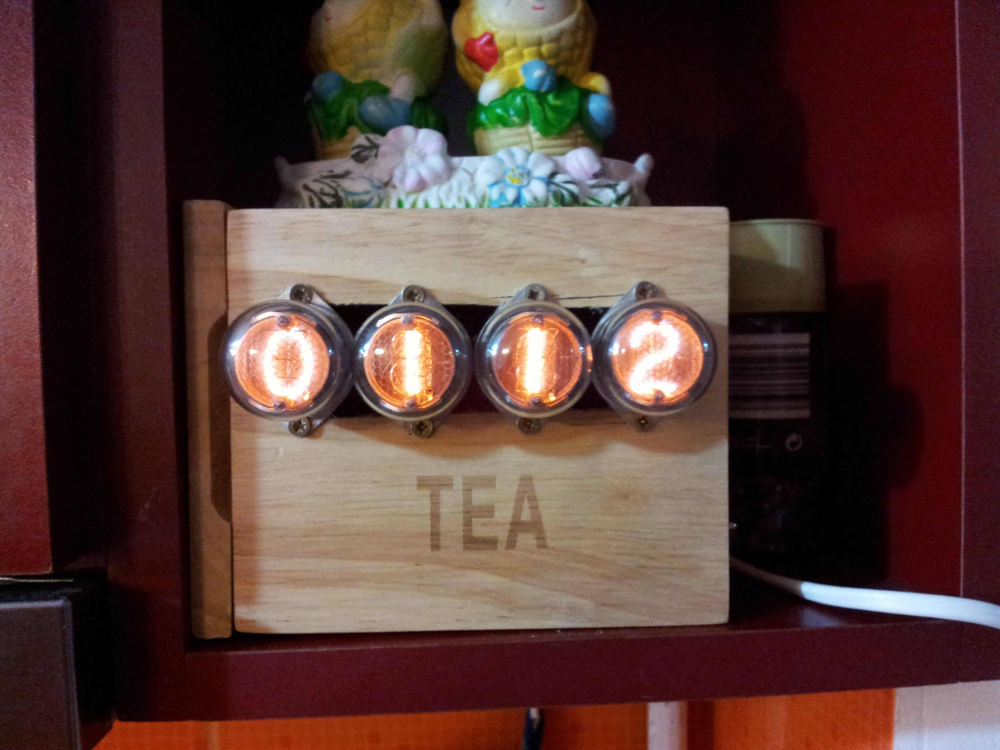

nixie-timer
===========
Source and schematics for my nixie kitchen timer. Check the code for conexions, the diagram might not be up to date. Code is in MikroC 

I coded for a 16F877 with a 10Mhz crystal (be sure to adjust TMR1 if you use a different crystal)

